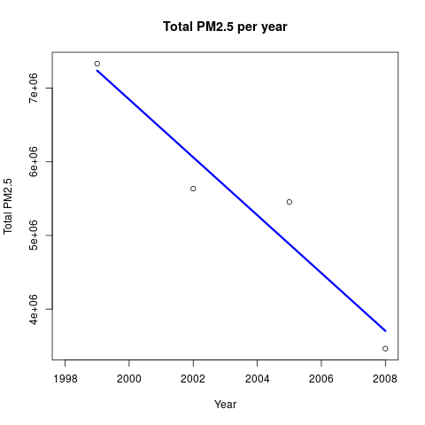
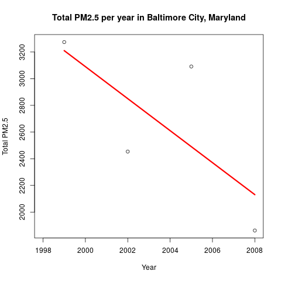
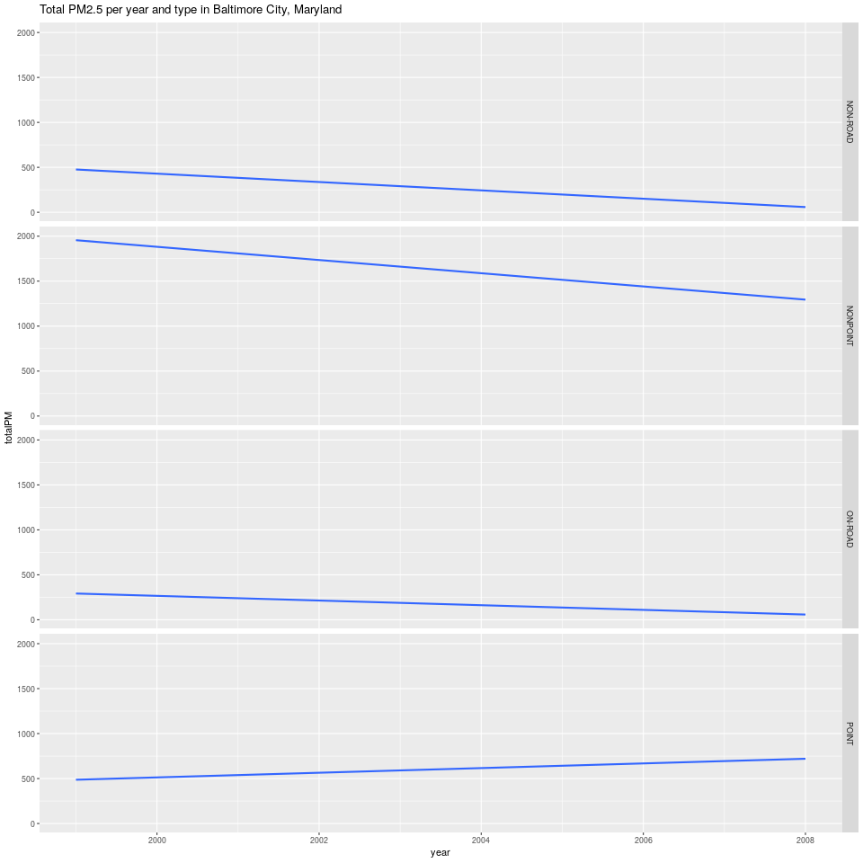
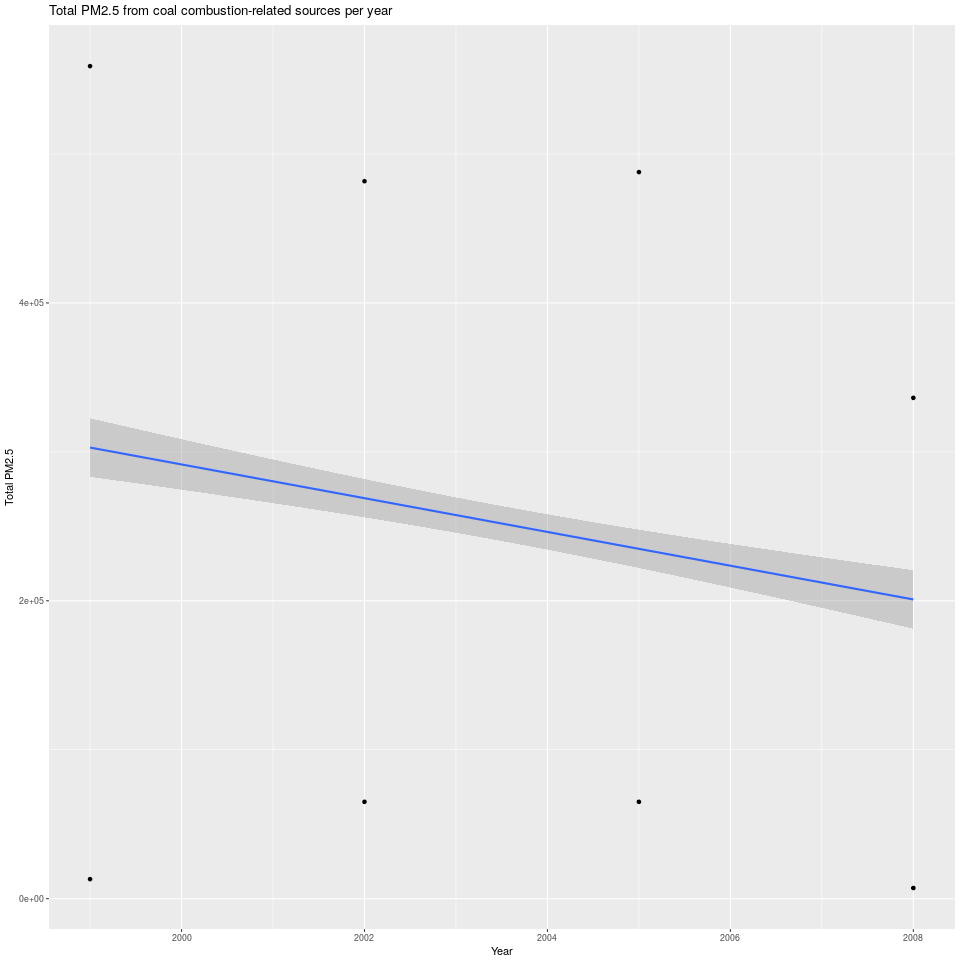
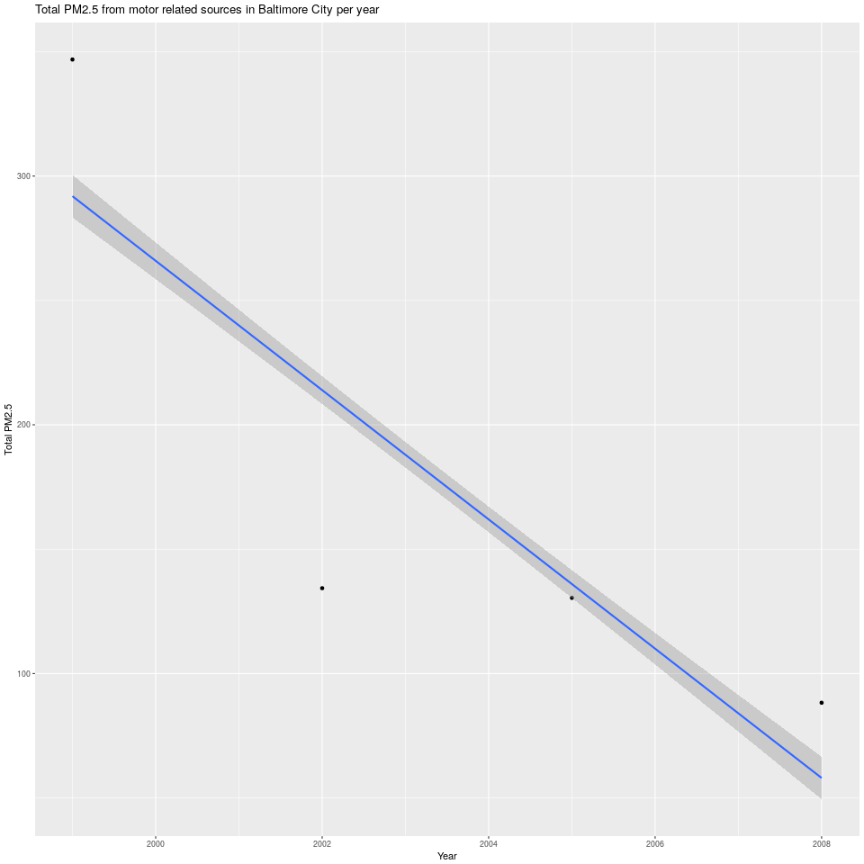
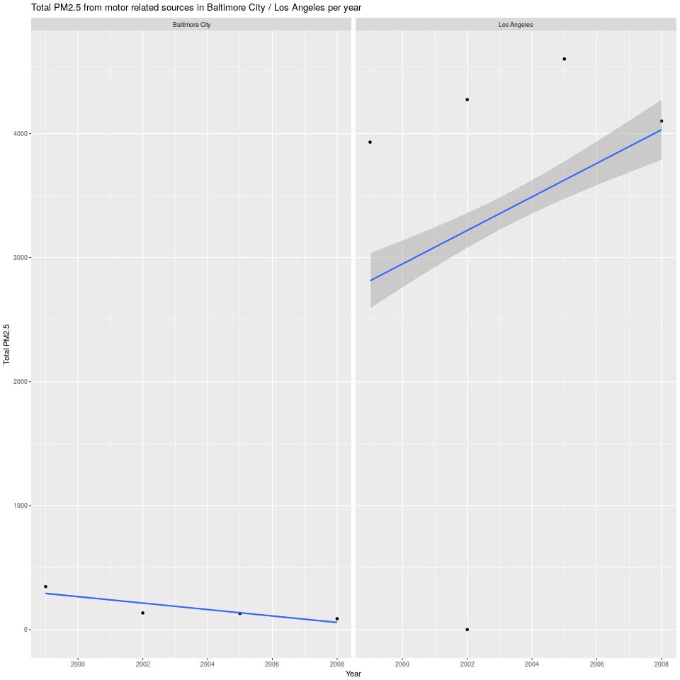

```{r setup, echo=TRUE, include=FALSE}
knitr::opts_chunk$set(echo = TRUE)
```

This report is the submition for the final course project [Exploratory Data Analysis](https://www.coursera.org/learn/exploratory-data-analysis/home/info).

## Setting up the enviroment
Working Directory
```{r setWD, echo=TRUE}
##Set the working Directory
wdPath <- "/home/fnieto/Documents/R-Programming-Training/datasciencecoursera/Exploratory Data Analysis/Week4/CourseProject/source"
setwd(wdPath)

##Define a variable to avoid read in every chunk the data
isChunkCode <- TRUE
```
Include the necessary R packages:

- dplyr
- ggplot2
- knitr
```{r includePackages, echo=TRUE, include=FALSE}
library(dplyr)
library(ggplot2)
library(knitr)
```

## Getting and loading the data
Fisrt step download the files from this [link](https://d396qusza40orc.cloudfront.net/exdata%2Fdata%2FNEI_data.zip), and load the data in the objects in the following way:

- **rdsEmi** <= summarySCC_PM25.rds 
- **rdsSource** <= Source_Classification_Code.rds.

#### The data must be stored in the **data** folder
```{r loadData, echo=TRUE}
rdsEmi <- readRDS("data/summarySCC_PM25.rds")
rdsSource <-readRDS("data/Source_Classification_Code.rds")
```

The **summarySCC_PM25.rds** file has the following Variables:

- **fips**: A five-digit number (represented as a string) indicating the U.S. county
- **SCC**: The name of the source as indicated by a digit string (see source code classification table)
- **Pollutant**: A string indicating the pollutant
- **Emissions**: Amount of PM2.5 emitted, in tons
- **type**: The type of source (point, non-point, on-road, or non-road)
- **year**: The year of emissions recorded

#### Exploring the **rdsEmi** object to know its dimensions, types of values
```{r knowDimensionsEmi, echo=TRUE}
str(rdsEmi)
```
The object rdsEmi has **`r as.character(dim(rdsEmi))`** dimensions. 

##### Evaluate how many observations per Year, type and Pollutan are included un the data set
```{r knowAmountDataEmi, echo=TRUE}
table(rdsEmi$year, rdsEmi$type, rdsEmi$Pollutant)
```
Based on the results in the data included only observations of the **PM25-PRI** pollutant and 4 types:
```{r knowTypeLevelsEmi, echo=TRUE}
levels(factor(rdsEmi$type))
```

##### Summarize the values of **Emissions** the PM2.5 
```{r knowSummariseDataSource, echo=TRUE}
summary(rdsEmi$Emissions)
```
The variable **Emissions** doesn't has NA's values

#### Exploring the **rdsSource** object to know its dimensions, types of values
```{r knowDimensionsSource, echo=TRUE}
str(rdsSource)
```
The object rdsSource has **`r as.character(dim(rdsSource))`** dimensions. 

The variables **Option.Group** and **Option.Set** has missing values, and variables **SCC, Short.Name, SCC.Level.Two, SCC.Level.Three and SCC.Level.Four** has to many different values. 

##### Evaluate the differents values for the Data.Category variable
```{r knowLevelsDataSource, echo=TRUE}
levels(factor(rdsSource$Data.Category))
```
Based on the results we're not interested in the in the Data.Category **Biogenic and Event**

##### Evaluate how many observations per Data.Category and SCC.Level.One are included un the data set
```{r knowAmountDataSource, echo=TRUE}
table(rdsSource$SCC.Level.One, rdsSource$Data.Category)
```
Based on the results we're not interested in the in the Data.Category **Biogenic and Event**


## Assignment: 
*Explore the National Emissions Inventory database and see what it say about fine particulate matter pollution in the United states over the 10-year period 1999–2008*

#### Question1: 
*Have total emissions from PM2.5 decreased in the United States from 1999 to 2008?*
Read the code chunk that contain the Exploratory graphic code for the plot #1
```{r question1CodeChunk, echo=TRUE}
read_chunk('plot1.R')
```

#### Answer: 
###### *The total amount of PM was decreased like the blue line show (Linerar regresion)*


#### Question2: 
*Have total emissions from PM2.5 decreased in the Baltimore City, Maryland (fips == "24510") from 1999 to 2008?*
Read the code chunk that contain the Exploratory graphic code for the plot #2
```{r question2CodeChunk, echo=TRUE}
read_chunk('plot2.R')
```

#### Answer: 
###### *The total amount of PM in the Baltimore City, Maryland was decreased like the blue line show (Linerar regresion)*


#### Question3: 
*Of the four types of sources indicated by the type (point, nonpoint, onroad, nonroad) variable:*

- *Which of these four sources have seen decreases in emissions from 1999–2008 for Baltimore City?*
- *Which have seen increases in emissions from 1999–2008?*
Read the code chunk that contain the Exploratory graphic code for the plot #3
```{r question3CodeChunk, echo=TRUE}
read_chunk('plot3.R')
```

#### Answer: 
###### *The sources * **NON-ROAD, NON-POINT and ON-ROAD** *was decreased like the line show (Linerar regresion)*
###### *The source * **POINT** *was increased like the line show (Linerar regresion)*


#### Question4: 
*How have emissions from coal combustion-related sources changed from 1999–2008?*

Read the code chunk that contain the Exploratory graphic code for the plot #4
```{r question4CodeChunk, echo=TRUE}
read_chunk('plot4.R')
```

#### Answer: 
###### *The emissions from coal combustion-related sources was decreased like the line show (Linerar regresion)*


#### Question5: 
*How have emissions from motor vehicle sources changed from 1999–2008 in Baltimore City?*

Read the code chunk that contain the Exploratory graphic code for the plot #5
```{r question5CodeChunk, echo=TRUE}
read_chunk('plot5.R')
```

#### Answer: 
###### *The emissions from motor - vehicle related sources was decreased like the line show (Linerar regresion)*


#### Question6: 
*Which city has seen greater changes over time in motor vehicle emissions between Baltimore City and Los Angeles?*

Read the code chunk that contain the Exploratory graphic code for the plot #6
```{r question6CodeChunk, echo=TRUE}
read_chunk('plot6.R')
```

#### Answer: 
###### *Baltimore City was decreased its PM values while Los Angeles City was increased its PM values*
