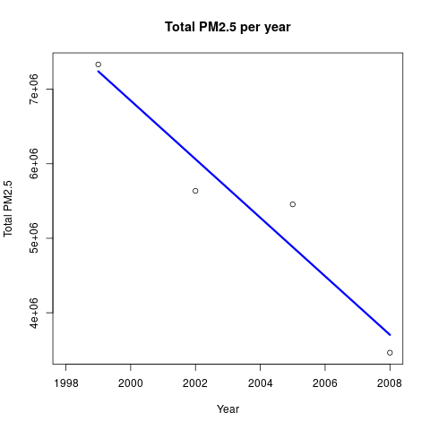
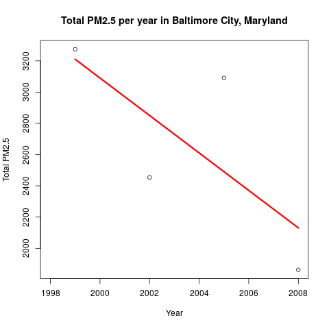
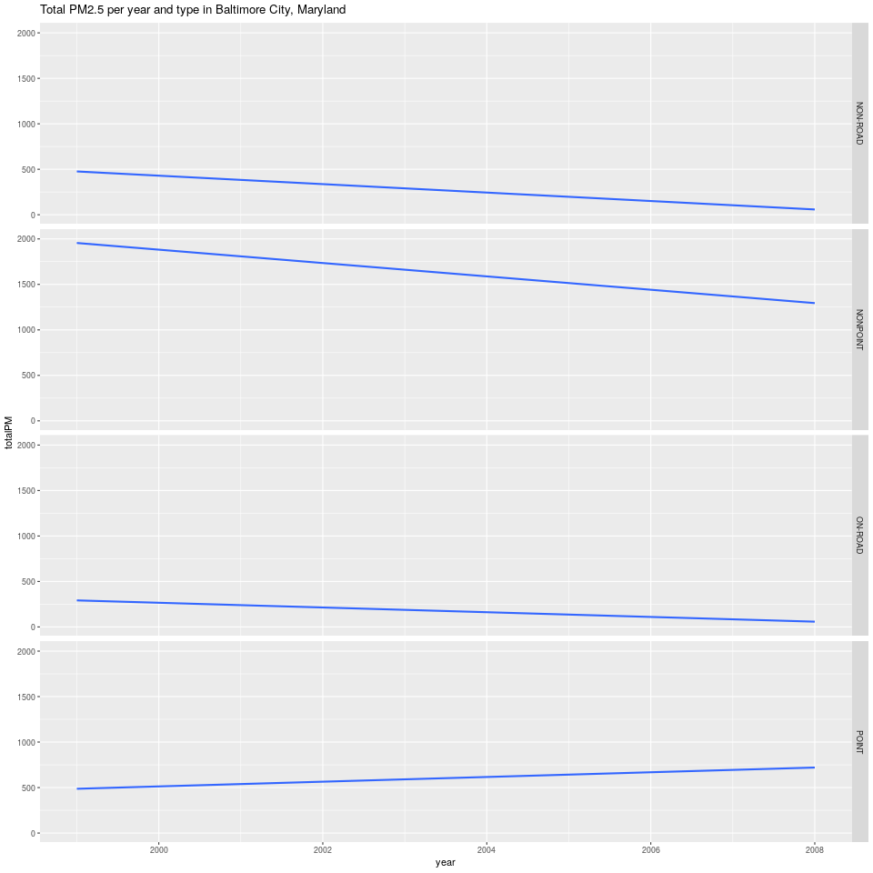
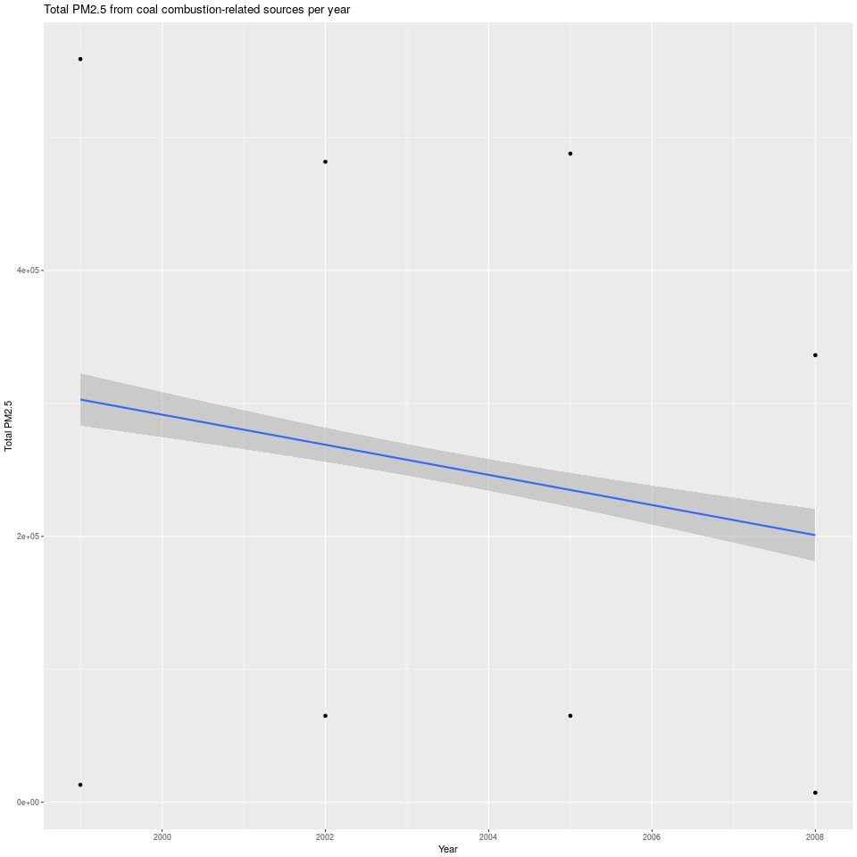

# Explotary Data Analysis Course Project
Fabian Nieto  
July 23, 2017  


This report is the submition for the final course project [Exploratory Data Analysis](https://www.coursera.org/learn/exploratory-data-analysis/home/info).

## Setting up the enviroment
Working Directory

```r
##Set the working Directory
wdPath <- "/home/fnieto/Documents/R-Programming-Training/datasciencecoursera/Exploratory Data Analysis/Week4/CourseProject/source"
setwd(wdPath)

##Define a variable to avoid read in every chunk the data
isChunkCode <- TRUE
```
Include the necessary R packages:

- dplyr
- ggplot2
- knitr


## Getting and loading the data
Fisrt step download the files from this [link](https://d396qusza40orc.cloudfront.net/exdata%2Fdata%2FNEI_data.zip), and load the data in the objects in the following way:

- **rdsEmi** <= summarySCC_PM25.rds 
- **rdsSource** <= Source_Classification_Code.rds.

#### The data must be stored in the **data** folder

```r
rdsEmi <- readRDS("data/summarySCC_PM25.rds")
rdsSource <-readRDS("data/Source_Classification_Code.rds")
```

The **summarySCC_PM25.rds** file has the following Variables:

- **fips**: A five-digit number (represented as a string) indicating the U.S. county
- **SCC**: The name of the source as indicated by a digit string (see source code classification table)
- **Pollutant**: A string indicating the pollutant
- **Emissions**: Amount of PM2.5 emitted, in tons
- **type**: The type of source (point, non-point, on-road, or non-road)
- **year**: The year of emissions recorded

#### Exploring the **rdsEmi** object to know its dimensions, types of values

```r
str(rdsEmi)
```

```
## 'data.frame':	6497651 obs. of  6 variables:
##  $ fips     : chr  "09001" "09001" "09001" "09001" ...
##  $ SCC      : chr  "10100401" "10100404" "10100501" "10200401" ...
##  $ Pollutant: chr  "PM25-PRI" "PM25-PRI" "PM25-PRI" "PM25-PRI" ...
##  $ Emissions: num  15.714 234.178 0.128 2.036 0.388 ...
##  $ type     : chr  "POINT" "POINT" "POINT" "POINT" ...
##  $ year     : int  1999 1999 1999 1999 1999 1999 1999 1999 1999 1999 ...
```
The object rdsEmi has **6497651, 6** dimensions. 

##### Evaluate how many observations per Year, type and Pollutan are included un the data set

```r
table(rdsEmi$year, rdsEmi$type, rdsEmi$Pollutant)
```

```
## , ,  = PM25-PRI
## 
##       
##        NON-ROAD NONPOINT ON-ROAD  POINT
##   1999   472362   102544  477883  55680
##   2002   618343   127240  890592  62502
##   2005   612129   127083  903983  70655
##   2008   621428   116892  911141 327194
```
Based on the results in the data included only observations of the **PM25-PRI** pollutant and 4 types:

```r
levels(factor(rdsEmi$type))
```

```
## [1] "NON-ROAD" "NONPOINT" "ON-ROAD"  "POINT"
```

##### Summarize the values of **Emissions** the PM2.5 

```r
summary(rdsEmi$Emissions)
```

```
##     Min.  1st Qu.   Median     Mean  3rd Qu.     Max. 
##      0.0      0.0      0.0      3.4      0.1 646952.0
```
The variable **Emissions** doesn't has NA's values

#### Exploring the **rdsSource** object to know its dimensions, types of values

```r
str(rdsSource)
```

```
## 'data.frame':	11717 obs. of  15 variables:
##  $ SCC                : Factor w/ 11717 levels "10100101","10100102",..: 1 2 3 4 5 6 7 8 9 10 ...
##  $ Data.Category      : Factor w/ 6 levels "Biogenic","Event",..: 6 6 6 6 6 6 6 6 6 6 ...
##  $ Short.Name         : Factor w/ 11238 levels "","2,4-D Salts and Esters Prod /Process Vents, 2,4-D Recovery: Filtration",..: 3283 3284 3293 3291 3290 3294 3295 3296 3292 3289 ...
##  $ EI.Sector          : Factor w/ 59 levels "Agriculture - Crops & Livestock Dust",..: 18 18 18 18 18 18 18 18 18 18 ...
##  $ Option.Group       : Factor w/ 25 levels "","C/I Kerosene",..: 1 1 1 1 1 1 1 1 1 1 ...
##  $ Option.Set         : Factor w/ 18 levels "","A","B","B1A",..: 1 1 1 1 1 1 1 1 1 1 ...
##  $ SCC.Level.One      : Factor w/ 17 levels "Brick Kilns",..: 3 3 3 3 3 3 3 3 3 3 ...
##  $ SCC.Level.Two      : Factor w/ 146 levels "","Agricultural Chemicals Production",..: 32 32 32 32 32 32 32 32 32 32 ...
##  $ SCC.Level.Three    : Factor w/ 1061 levels "","100% Biosolids (e.g., sewage sludge, manure, mixtures of these matls)",..: 88 88 156 156 156 156 156 156 156 156 ...
##  $ SCC.Level.Four     : Factor w/ 6084 levels "","(NH4)2 SO4 Acid Bath System and Evaporator",..: 4455 5583 4466 4458 1341 5246 5584 5983 4461 776 ...
##  $ Map.To             : num  NA NA NA NA NA NA NA NA NA NA ...
##  $ Last.Inventory.Year: int  NA NA NA NA NA NA NA NA NA NA ...
##  $ Created_Date       : Factor w/ 57 levels "","1/27/2000 0:00:00",..: 1 1 1 1 1 1 1 1 1 1 ...
##  $ Revised_Date       : Factor w/ 44 levels "","1/27/2000 0:00:00",..: 1 1 1 1 1 1 1 1 1 1 ...
##  $ Usage.Notes        : Factor w/ 21 levels ""," ","includes bleaching towers, washer hoods, filtrate tanks, vacuum pump exhausts",..: 1 1 1 1 1 1 1 1 1 1 ...
```
The object rdsSource has **11717, 15** dimensions. 

The variables **Option.Group** and **Option.Set** has missing values, and variables **SCC, Short.Name, SCC.Level.Two, SCC.Level.Three and SCC.Level.Four** has to many different values. 

##### Evaluate the differents values for the Data.Category variable

```r
levels(factor(rdsSource$Data.Category))
```

```
## [1] "Biogenic" "Event"    "Nonpoint" "Nonroad"  "Onroad"   "Point"
```
Based on the results we're not interested in the in the Data.Category **Biogenic and Event**

##### Evaluate how many observations per Data.Category and SCC.Level.One are included un the data set

```r
table(rdsSource$SCC.Level.One, rdsSource$Data.Category)
```

```
##                                          
##                                           Biogenic Event Nonpoint Nonroad
##   Brick Kilns                                    0     0        1       0
##   Domestic Ammonia                               0     0        1       0
##   External Combustion Boilers                    0     0        0       0
##   Industrial Processes                           0     0      273       0
##   Internal Combustion Engines                    0     0        0       0
##   LPG Distribution                               0     0        1       0
##   MACT Source Categories                         0     0        0       0
##   Miscellaneous Area Sources                     0    71      235       0
##   Mobile Sources                                 0     0       59     572
##   Natural Sources                               82     0        0       0
##   Petroleum and Solvent Evaporation              0     0        0       0
##   Solvent Utilization                            0     0     1061       0
##   Stationary Source Fuel Combustion              0     0      109       0
##   Storage and Transport                          0     0      489       0
##   very misc                                      0     0        1       0
##   Waste Disposal                                 0     0        0       0
##   Waste Disposal, Treatment, and Recovery        0     0       75       0
##                                          
##                                           Onroad Point
##   Brick Kilns                                  0     0
##   Domestic Ammonia                             0     0
##   External Combustion Boilers                  0   227
##   Industrial Processes                         0  4514
##   Internal Combustion Engines                  0   233
##   LPG Distribution                             0     0
##   MACT Source Categories                       0   686
##   Miscellaneous Area Sources                   0     0
##   Mobile Sources                            1137    19
##   Natural Sources                              0     0
##   Petroleum and Solvent Evaporation            0  1563
##   Solvent Utilization                          0     0
##   Stationary Source Fuel Combustion            0     0
##   Storage and Transport                        0     0
##   very misc                                    0     1
##   Waste Disposal                               0   307
##   Waste Disposal, Treatment, and Recovery      0     0
```
Based on the results we're not interested in the in the Data.Category **Biogenic and Event**


## Assignment: 
*Explore the National Emissions Inventory database and see what it say about fine particulate matter pollution in the United states over the 10-year period 1999–2008*

#### Question1: 
*Have total emissions from PM2.5 decreased in the United States from 1999 to 2008?*
Read the code chunk that contain the Exploratory graphic code for the plot #1

```r
read_chunk('plot1.R')
```

#### Answer: 
###### *The total amount of PM was decreased like the blue line show (Linerar regresion)*


#### Question2: 
*Have total emissions from PM2.5 decreased in the Baltimore City, Maryland (fips == "24510") from 1999 to 2008?*
Read the code chunk that contain the Exploratory graphic code for the plot #2

```r
read_chunk('plot2.R')
```

#### Answer: 
###### *The total amount of PM in the Baltimore City, Maryland was decreased like the blue line show (Linerar regresion)*


#### Question3: 
*Of the four types of sources indicated by the type (point, nonpoint, onroad, nonroad) variable:*

- *Which of these four sources have seen decreases in emissions from 1999–2008 for Baltimore City?*
- *Which have seen increases in emissions from 1999–2008?*
Read the code chunk that contain the Exploratory graphic code for the plot #3

```r
read_chunk('plot3.R')
```

#### Answer: 
###### *The sources * **NON-ROAD, NON-POINT and ON-ROAD** *was decreased like the line show (Linerar regresion)*
###### *The source * **POINT** *was increased like the line show (Linerar regresion)*


#### Question4: 
*How have emissions from coal combustion-related sources changed from 1999–2008?*

Read the code chunk that contain the Exploratory graphic code for the plot #4

```r
read_chunk('plot4.R')
```

#### Answer: 
###### *The emissions from coal combustion-related sources was decreased like the line show (Linerar regresion)*


#### Question5: 
*How have emissions from motor vehicle sources changed from 1999–2008 in Baltimore City?*

Read the code chunk that contain the Exploratory graphic code for the plot #5

```r
read_chunk('plot5.R')
```

#### Answer: 
###### *The emissions from motor - vehicle related sources was decreased like the line show (Linerar regresion)*


#### Question6: 
*Which city has seen greater changes over time in motor vehicle emissions between Baltimore City and Los Angeles?*

Read the code chunk that contain the Exploratory graphic code for the plot #6

```r
read_chunk('plot6.R')
```

#### Answer: 
###### *Baltimore City was decreased its PM values while Los Angeles City was increased its PM values*

